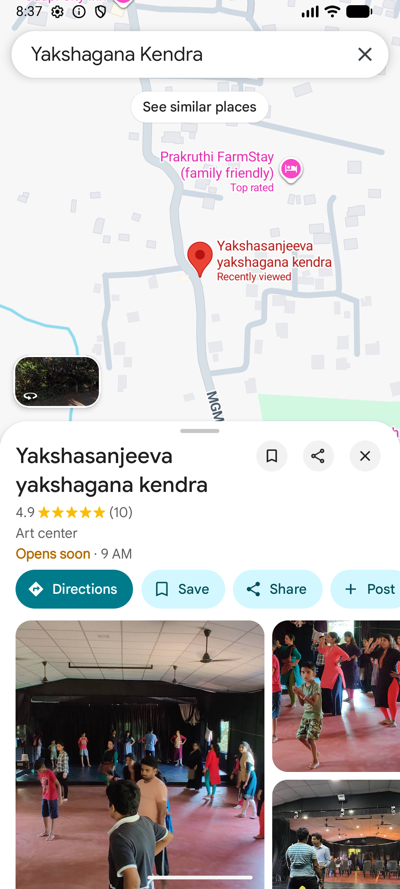

# Karunada-Kala

## Project Description
Karunada-Kala is an Android application that connects people with Karnataka's traditional arts, crafts, and cultural heritage. It helps preserve and promote local artisan communities by providing a centralized platform for discovery, learning, and engagement.

## Problem Statement
Karnataka's traditional arts and crafts lack visibility among younger generations. Artisans are scattered across the state with no centralized discovery platform, and cultural events have limited accessibility and awareness.

## Features
- **Explore Arts** – Browse and learn about Karnataka art forms (Yakshagana, Bidriware, Channapatna Toys, etc.)
- **Artisan Map** – Discover artisan locations across Karnataka and connect via direct calling
- **Workshop Registration** – Register for cultural workshops and training sessions
- **Event Feed** – Stay updated on upcoming cultural events and festivals

## Tech Stack
- **Language:** Kotlin
- **UI Framework:** Jetpack Compose
- **APIs:** Google Maps API
- **Development Environment:** Android Studio
- **Version Control:** GitHub

## Installation & Setup

### Prerequisites
- Android Studio (latest version)
- Android SDK 24 or higher
- Google Maps API key

### Steps to Run
1. Clone the repository:
```bash
git clone https://github.com/Ashikshetty05/Karunada_Kala.git
```

2. Open the project in Android Studio

3. Create `local.properties` in the root directory and add:
GOOGLE_API_KEY=your_api_key_here

4. Sync Gradle and build the project

5. Run on emulator or physical device

## Project Structure
app/
├── src/main/
│   ├── java/com/example/karunadakala1/
│   │   └── MainActivity.kt
│   ├── res/
│   └── AndroidManifest.xml
├── build.gradle.kts
└── local.properties

## Screenshots

### Home Screen


### Explore Arts


### Artisan Map


### Workshops


## User Journey
1. **Browse Art Forms** → Click "Explore Arts" to discover Karnataka art forms
2. **Find Artisans** → Click "Artisan Map" to view locations and call artisans directly
3. **Register for Workshops** → Enter name and phone in "Workshops" section
4. **View Events** → Check "Event Feed" for upcoming cultural events

## Future Improvements
- User authentication and profile management
- Real-time workshop availability
- Database integration for persistent data storage
- Push notifications for event updates
- Multi-language support (Kannada language interface)
- Rating and review system for artisans

## Author
**Ashik K Shetty**
- USN: 1CE22CS021
- College: City Engineering College, Bangalore
- Internship: MindMatrix (90 days)

## License
This project is open source and available for educational purposes.
